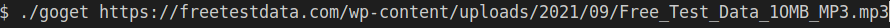
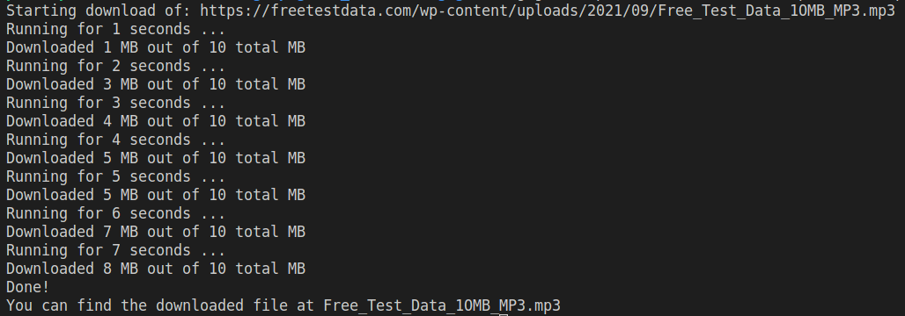

# GoGet

## Default use

Out of the box, goget requires only a valid, complete, URL to work.

This should start a download, log progress every second and save the file Free_Test_Data_1OMB_MP3.mp3 in your current directory.

## Customization

You can modify the tool's beahviour with the following flags:

| Flag | Type | Default | Meaning
| :---:|:--:|:--:|:--|
| p | string | N/D | where the file will be downloaded, default to a file with the same name in our current directory |
| i | int    | 1   | the interval, in seconds, between each update log|
    

