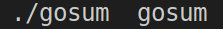
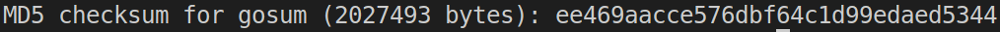

# GoSum

## Default use

gosum requires only a valid path to a file to work.

## Customization

You can modify the tool's behaviour with the following flags:

| Flag | Type | Default | Meaning
| :---:|:--:|:--:|:--|
| b | int | 256 | the size, in bytes, of the buffer used to read the file's contents |
| c | string    | /  | the checksum against which the computed one will be verified|